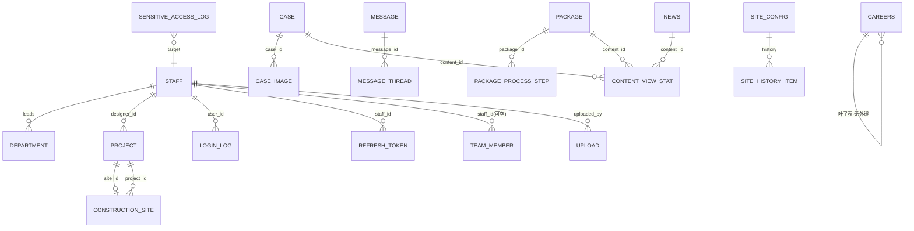

# 数据库设计文档 · 栖屿设计（React + FastAPI 生产化）

> 版本：v1.0　|　日期：2026-08-25　|　状态：基线版（已与《开发技术文档》对齐）
> 依据文档：`01-室内设计prd.md` v1.2 + `02-开发技术文档.md`（§5 数据库设计 + 附录 D 完整 DDL + §2 的 13 条 ADR）
> 数据库：PostgreSQL 16　|　ORM：SQLAlchemy 2.x（后端 FastAPI）　|　迁移：Alembic

---

## 目录

- [第 1 章 设计基线](#第-1-章-设计基线)
  - [1.1 文档目的与读者](#11-文档目的与读者)
  - [1.2 与《开发技术文档》的关系](#12-与开发技术文档的关系)
  - [1.3 版本与维护约定](#13-版本与维护约定)
  - [1.4 数据库相关 ADR 摘录](#14-数据库相关-adr-摘录)
  - [1.5 命名与类型公约](#15-命名与类型公约)
- [第 2 章 设计概览](#第-2-章-设计概览)
  - [2.1 六个限界上下文](#21-六个限界上下文)
  - [2.2 二十张表清单速查](#22-二十张表清单速查)
- [第 3 章 ER 图](#第-3-章-er-图)
- [第 4 章 数据字典（20 张表）](#第-4-章-数据字典20-张表)
- [第 5 章 建表 SQL（完整可执行）](#第-5-章-建表-sql完整可执行)
- [第 6 章 索引与查询优化](#第-6-章-索引与查询优化)
- [第 7 章 敏感字段与合规](#第-7-章-敏感字段与合规)
- [第 8 章 标签多维建模](#第-8-章-标签多维建模)
- [第 9 章 迁移与种子](#第-9-章-迁移与种子)
- [附录 A 枚举全集](#附录-a-枚举全集)
- [附录 B 数据库相关环境变量](#附录-b-数据库相关环境变量)
- [附录 C 三向一致性自校](#附录-c-三向一致性自校)
- [附录 D 修订记录](#附录-d-修订记录)

---

## 第 1 章 设计基线

### 1.1 文档目的与读者

把"数据库"这一关注点从《开发技术文档》里单独抽出来，形成一份**自包含的数据库设计文档**，作为 DBA / 后端 / 测试 / 运维的**单一事实源（Single Source of Truth）**。三大核心交付：**ER 图、数据字典、建表 SQL**。

| 读者 | 主要关注 |
|---|---|
| 后端开发 | 字段类型、约束、枚举、外键、`revalidate` 副作用的数据来源 |
| DBA | 索引、部分索引、GIN、查询计划、备份/恢复 |
| 测试 | 造数与断言依据（字段边界、枚举值、状态机） |
| 运维 | 建库脚本、迁移、种子、敏感字段合规 |
| 技术负责人 | 评审表结构演进与取舍 |

### 1.2 与《开发技术文档》的关系

- 本文档是"纯数据库视角"；技术文档 §5 是"架构语境下的数据库"，可标注"详细 DDL / 数据字典见《数据库设计文档》"。
- 本文档**不重复** API 接口、前端实现、部署运维等内容，仅引用。
- 所有 DDL 与《开发技术文档》附录 D 完全一致，本文档 §5 为可直接 `psql -f` 运行的整合版。

### 1.3 版本与维护约定

- 任何表结构变更必须：① 先改本文档 §4 字典 + §5 SQL；② 生成 Alembic 迁移（§9）；③ 同步更新 §3 ER 图与附录 A 枚举。
- 枚举增删必须评估在线变更成本（见 §1.5 公约）。
- 文档与代码以 Alembic `head` 为准，本文档为 `head` 时刻的快照。

### 1.4 数据库相关 ADR 摘录

> 完整 13 条 ADR 见《开发技术文档》§2。此处仅摘录与数据库强相关者。

| ADR | 决策 | 放弃的代价 / 推翻条件 |
|---|---|---|
| **ADR-002** PostgreSQL 16 | 用 PG 而非 SQLite；JSONB + GIN 支撑案例多维标签筛选、并发写入、成熟备份 | 放弃"零运维单文件"；DB 容器需运维。推翻：团队无 PG 运维能力且数据量极小 |
| **ADR-005** 可撤销刷新令牌 | `refresh_tokens` 独立表（非仅 JWT 无状态）；`revoked` 标记支持强制下线 | 放弃纯无状态鉴权；多一次表查询。推翻：若改无状态短期令牌且接受无法强制吊销 |
| **ADR-008** 标签用 JSONB+GIN | `style_tags`/`house_type_tags` 用 JSONB 数组 + GIN，非 EAV 关联表 | 放弃标签维度强一致统计。推翻：需"标签占比分析/多语言/别名"时拆 `tags`+`case_tags` |
| **ADR-009** 身份证 AES 应用层加密 | `staff.id_card` 落库即 AES-256-GCM 密文 + 脱敏 + 审计表 | 放弃 pgcrypto（密钥落库侧会泄库即泄密）。推翻：仅当密钥管理改为 KMS 托管且库与密钥物理隔离 |

**类型公约（ADR 摘录 + §5.1 细化）**

| 约定 | 规则 | 理由 |
|---|---|---|
| 命名 | `snake_case`，表名复数，列名单数 | 与 PostgreSQL 惯例一致 |
| 主键 | `BIGINT GENERATED ALWAYS AS IDENTITY`；对外暴露用 `slug`/`code`，不暴露自增 ID | 避免暴露数据规模与遍历 |
| 时间戳 | `timestamptz`（UTC），`created_at`/`updated_at` 由触发器/ORM 维护 | 跨时区一致 |
| 软删除 | `deleted_at timestamptz NULL`，查询默认 `WHERE deleted_at IS NULL` | 避免误删、便于审计 |
| 枚举 | **VARCHAR + CHECK 约束**，不使用 PG `ENUM` 类型 | 加值不锁表、可在线变更 |
| 金额 | `NUMERIC(12,2)`，单位"元"，注释标明 | 避免浮点误差 |
| 标签/配置 | `JSONB`（`style_tags` 等存 `text[]` 语义的 JSON 数组） | 配合 GIN 索引 |
| 字符集 | `UTF8`，`lc_collate=C` 用于需精确排序的字段库 | 中文检索稳定 |
| 索引 | 外键、高频筛选列、排序列均建索引 | 保障列表 P95 ≤ 300ms（PRD §10） |

### 1.5 命名与类型公约（速查）

- **表**：复数小写 `cases`、`messages`；单例配置 `site_config`（固定 `id=1`）。
- **列**：`snake_case`；布尔 `is_*`/`active`/`revoked`；外键 `<entity>_id`；时间 `*_at`；软删 `deleted_at`。
- **CHECK 枚举**：所有状态/类型列用 `VARCHAR(n) CHECK (col IN (...))`，便于在线加值。
- **部分索引**：列表查询的"仅已发布"条件用 `WHERE status='published'` 部分索引，降低索引体积。
- **GIN**：JSONB 标签列建 `USING GIN`，支撑 `@>` 包含查询。

## 第 2 章 设计概览

### 2.1 六个限界上下文

数据库按领域划分为 6 个限界上下文（Bounded Context），各自内聚、跨域通过外键/引用耦合：

| 限界上下文 | 表数 | 职责 | 关键耦合 |
|---|---|---|---|
| **content 内容** | 8 | 官网展示与后台 CMS 核心 | 浏览量聚合 `content_view_stats` 统一收口 case/package/news |
| **org 组织与鉴权** | 5 | 多角色账号、部门、登录与审计 | `staff` 是关系枢纽（挂 7 条出线） |
| **delivery 交付** | 2 | 业务主线（预约→签约→施工→验收） | `projects` ↔ `construction_sites` 1:0..1 |
| **lead 线索** | 2 | 获客闭环 | `messages` → `message_threads` 一对多 |
| **siteconfig 站点配置** | 2 | 关于我们静态内容 | `site_config`(单例) → `site_history_items` 1:0..1 |
| **upload 文件** | 1 | 图片/文件落盘索引 | `uploads` 被 `staff` 等引用（owner 多态） |

> 合计 **20 张表**。ER 图中 `careers`（招聘岗位）明确归入 **content** BC，作为无外键的叶子表。

### 2.2 二十张表清单速查

| # | 表名 | BC | 中文 | 主键 | 关键列 | PRD 映射 |
|---|---|---|---|---|---|---|
| 1 | `cases` | content | 案例 | id | slug*, category, style_tags, status | §7.2 / §8.2 |
| 2 | `case_images` | content | 案例图集 | id | case_id(FK), url, sort | §8.2 |
| 3 | `packages` | content | 套餐 | id | slug*, type, price_per_sqm | §5.2 / §8.3 |
| 4 | `package_process_steps` | content | 套餐流程步骤 | id | package_id(FK), step_no | §5.3 / §8.3 |
| 5 | `news` | content | 资讯 | id | slug*, category, status | §7.8 / §8.6 |
| 6 | `careers` | content | 招聘岗位 | id | category, type, status | §7.7 / §8.x |
| 7 | `team_members` | content | 团队档案 | id | staff_id?(FK), order, active | §7.5 / §8.12 |
| 8 | `content_view_stats` | content | 浏览量日聚合 | (type,id,date) | content_type, content_id, views | §7.2 |
| 9 | `staff` | org | 内部账号 | id | username*, role, password_hash | §8.1 / §8.7 |
| 10 | `departments` | org | 部门 | id | name, lead, sort | §8.8 |
| 11 | `login_logs` | org | 登录日志 | id | user_id?(FK), login_time | §8.9 |
| 12 | `refresh_tokens` | org | 刷新令牌 | id | staff_id(FK), token_hash, revoked | ADR-005 |
| 13 | `sensitive_access_logs` | org | 敏感字段访问审计 | id | target_id, operator_id?(FK) | Q11 / ADR-009 |
| 14 | `messages` | lead | 留言/预约 | id | name, phone, kind, status | §7.6 / §8.4 |
| 15 | `message_threads` | lead | 沟通记录 | id | message_id(FK), type, content | §8.4 |
| 16 | `projects` | delivery | 项目 | id | code*, status, designer_id?(FK) | §8.11 |
| 17 | `construction_sites` | delivery | 工地联系 | id | project_id?(FK), supervisor | §8.13 |
| 18 | `site_config` | siteconfig | 站点配置(单例) | id=1 | contact_info(JSONB) | §8.10 |
| 19 | `site_history_items` | siteconfig | 发展历程时间线 | id | year, title, sort | §7.4 / §8.10 |
| 20 | `uploads` | upload | 上传文件索引 | id | owner_type, owner_id, storage_key | §9.3 / ADR-007 |

> `*` = 业务唯一键（对外暴露，替代自增 ID）；`?` = 可空外键。

---

## 第 3 章 ER 图

> 下图由 `/架构图与流程图绘制专家` 技能生成，按 6 个限界上下文用虚线分组，实体为带表名+关键字段的卡片，关系线标注**基数**（1 / 0..1 / 0..N）与**角色名**（如 `designer_id`、`site_id`、`target`）。`careers` 为无外键叶子表，归入 content BC。

<svg style="width:100%;height:auto;max-width:960px;display:block;margin:1rem auto;" viewBox="0 0 680 800" xmlns="http://www.w3.org/2000/svg" font-family="sans-serif">
  <style>
    .t{font:700 12px sans-serif;fill:#3a2f22;text-anchor:middle}
    .f{font:10.5px sans-serif;fill:#5b4a36;text-anchor:middle}
    .gtitle{font:700 12px sans-serif;fill:#4a3a26}
    .edge{fill:none;stroke:#6b5a45;stroke-width:1.3}
    .elabel{font:10px sans-serif;fill:#3a2f22;text-anchor:middle}
    .card{font:9px sans-serif;fill:#7a5a32;text-anchor:middle}
    .bg{fill:#ffffff}
    .gbox{fill:none;stroke-width:1.4;stroke-dasharray:6 3}
    .leg{font:10px sans-serif;fill:#4a3a26}
  </style>

  <text x="340" y="26" text-anchor="middle" font-size="15" font-weight="bold" fill="#1a1a2e">E-R 图 · 栖屿设计（20 张表 / 6 个限界上下文）</text>

  <!-- ===================== 分组容器 ===================== -->
  <rect class="gbox" x="16" y="52" width="314" height="300" rx="10" stroke="#d98aa6" fill="#fdeaef"/>
  <text class="gtitle" x="28" y="70">org 组织与鉴权</text>
  <rect class="gbox" x="16" y="368" width="314" height="116" rx="10" stroke="#7bb98a" fill="#e8f4ea"/>
  <text class="gtitle" x="28" y="386">lead 线索</text>
  <rect class="gbox" x="16" y="500" width="314" height="116" rx="10" stroke="#8a93d6" fill="#eef0fb"/>
  <text class="gtitle" x="28" y="518">siteconfig 站点配置</text>
  <rect class="gbox" x="16" y="632" width="314" height="116" rx="10" stroke="#d9a86a" fill="#fbf2e3"/>
  <text class="gtitle" x="28" y="650">upload 文件</text>

  <rect class="gbox" x="350" y="52" width="314" height="392" rx="10" stroke="#b08ad9" fill="#f3ecfb"/>
  <text class="gtitle" x="362" y="70">content 内容</text>
  <rect class="gbox" x="350" y="460" width="314" height="116" rx="10" stroke="#6bbdb3" fill="#e6f6f4"/>
  <text class="gtitle" x="362" y="478">delivery 交付</text>

  <!-- ===================== 实体框 ===================== -->
  <!-- STAFF -->
  <g>
    <rect x="24" y="82" width="150" height="52" rx="6" fill="#fff" stroke="#c9b79c" stroke-width="1.2"/>
    <rect x="24" y="82" width="150" height="20" rx="6" fill="#e6a9c0"/>
    <rect x="24" y="92" width="150" height="10" fill="#e6a9c0"/>
    <text class="t" x="99" y="96">STAFF</text>
    <text class="f" x="99" y="116">id PK</text>
    <text class="f" x="99" y="130">username* role</text>
  </g>
  <!-- DEPARTMENT -->
  <g>
    <rect x="192" y="82" width="150" height="52" rx="6" fill="#fff" stroke="#c9b79c" stroke-width="1.2"/>
    <rect x="192" y="82" width="150" height="20" rx="6" fill="#e6a9c0"/>
    <rect x="192" y="92" width="150" height="10" fill="#e6a9c0"/>
    <text class="t" x="267" y="96">DEPARTMENT</text>
    <text class="f" x="267" y="116">id PK</text>
    <text class="f" x="267" y="130">lead 快照</text>
  </g>
  <!-- LOGIN_LOG -->
  <g>
    <rect x="24" y="154" width="150" height="52" rx="6" fill="#fff" stroke="#c9b79c" stroke-width="1.2"/>
    <rect x="24" y="154" width="150" height="20" rx="6" fill="#e6a9c0"/>
    <rect x="24" y="164" width="150" height="10" fill="#e6a9c0"/>
    <text class="t" x="99" y="168">LOGIN_LOG</text>
    <text class="f" x="99" y="188">id PK</text>
    <text class="f" x="99" y="202">user_id</text>
  </g>
  <!-- REFRESH_TOKEN -->
  <g>
    <rect x="192" y="154" width="150" height="52" rx="6" fill="#fff" stroke="#c9b79c" stroke-width="1.2"/>
    <rect x="192" y="154" width="150" height="20" rx="6" fill="#e6a9c0"/>
    <rect x="192" y="164" width="150" height="10" fill="#e6a9c0"/>
    <text class="t" x="267" y="168">REFRESH_TOKEN</text>
    <text class="f" x="267" y="188">id PK</text>
    <text class="f" x="267" y="202">staff_id</text>
  </g>
  <!-- SENSITIVE_ACCESS_LOG -->
  <g>
    <rect x="84" y="226" width="150" height="52" rx="6" fill="#fff" stroke="#c9b79c" stroke-width="1.2"/>
    <rect x="84" y="226" width="150" height="20" rx="6" fill="#e6a9c0"/>
    <rect x="84" y="236" width="150" height="10" fill="#e6a9c0"/>
    <text class="t" x="159" y="240">SENSITIVE_ACCESS_LOG</text>
    <text class="f" x="159" y="260">id PK</text>
    <text class="f" x="159" y="274">target→Staff</text>
  </g>

  <!-- MESSAGE -->
  <g>
    <rect x="24" y="396" width="150" height="52" rx="6" fill="#fff" stroke="#c9b79c" stroke-width="1.2"/>
    <rect x="24" y="396" width="150" height="20" rx="6" fill="#9ed3ac"/>
    <rect x="24" y="406" width="150" height="10" fill="#9ed3ac"/>
    <text class="t" x="99" y="410">MESSAGE</text>
    <text class="f" x="99" y="430">id PK</text>
    <text class="f" x="99" y="444">kind status</text>
  </g>
  <!-- MESSAGE_THREAD -->
  <g>
    <rect x="192" y="396" width="150" height="52" rx="6" fill="#fff" stroke="#c9b79c" stroke-width="1.2"/>
    <rect x="192" y="396" width="150" height="20" rx="6" fill="#9ed3ac"/>
    <rect x="192" y="406" width="150" height="10" fill="#9ed3ac"/>
    <text class="t" x="267" y="410">MESSAGE_THREAD</text>
    <text class="f" x="267" y="430">id PK</text>
    <text class="f" x="267" y="444">message_id</text>
  </g>

  <!-- SITE_CONFIG -->
  <g>
    <rect x="24" y="528" width="150" height="52" rx="6" fill="#fff" stroke="#c9b79c" stroke-width="1.2"/>
    <rect x="24" y="528" width="150" height="20" rx="6" fill="#a8b0e6"/>
    <rect x="24" y="538" width="150" height="10" fill="#a8b0e6"/>
    <text class="t" x="99" y="542">SITE_CONFIG</text>
    <text class="f" x="99" y="562">id PK</text>
    <text class="f" x="99" y="576">id=1 单例</text>
  </g>
  <!-- SITE_HISTORY_ITEM -->
  <g>
    <rect x="192" y="528" width="150" height="52" rx="6" fill="#fff" stroke="#c9b79c" stroke-width="1.2"/>
    <rect x="192" y="528" width="150" height="20" rx="6" fill="#a8b0e6"/>
    <rect x="192" y="538" width="150" height="10" fill="#a8b0e6"/>
    <text class="t" x="267" y="542">SITE_HISTORY_ITEM</text>
    <text class="f" x="267" y="562">id PK</text>
    <text class="f" x="267" y="576">year* sort</text>
  </g>

  <!-- UPLOAD -->
  <g>
    <rect x="24" y="660" width="150" height="52" rx="6" fill="#fff" stroke="#c9b79c" stroke-width="1.2"/>
    <rect x="24" y="660" width="150" height="20" rx="6" fill="#ecc78a"/>
    <rect x="24" y="670" width="150" height="10" fill="#ecc78a"/>
    <text class="t" x="99" y="674">UPLOAD</text>
    <text class="f" x="99" y="694">id PK</text>
    <text class="f" x="99" y="708">owner_type</text>
  </g>

  <!-- CASE -->
  <g>
    <rect x="358" y="82" width="150" height="52" rx="6" fill="#fff" stroke="#c9b79c" stroke-width="1.2"/>
    <rect x="358" y="82" width="150" height="20" rx="6" fill="#c3a3e6"/>
    <rect x="358" y="92" width="150" height="10" fill="#c3a3e6"/>
    <text class="t" x="433" y="96">CASE</text>
    <text class="f" x="433" y="116">id PK</text>
    <text class="f" x="433" y="130">slug* status</text>
  </g>
  <!-- CASE_IMAGE -->
  <g>
    <rect x="524" y="82" width="150" height="52" rx="6" fill="#fff" stroke="#c9b79c" stroke-width="1.2"/>
    <rect x="524" y="82" width="150" height="20" rx="6" fill="#c3a3e6"/>
    <rect x="524" y="92" width="150" height="10" fill="#c3a3e6"/>
    <text class="t" x="599" y="96">CASE_IMAGE</text>
    <text class="f" x="599" y="116">id PK</text>
    <text class="f" x="599" y="130">case_id</text>
  </g>
  <!-- PACKAGE -->
  <g>
    <rect x="358" y="154" width="150" height="52" rx="6" fill="#fff" stroke="#c9b79c" stroke-width="1.2"/>
    <rect x="358" y="154" width="150" height="20" rx="6" fill="#c3a3e6"/>
    <rect x="358" y="164" width="150" height="10" fill="#c3a3e6"/>
    <text class="t" x="433" y="168">PACKAGE</text>
    <text class="f" x="433" y="188">id PK</text>
    <text class="f" x="433" y="202">slug* type</text>
  </g>
  <!-- PACKAGE_PROCESS_STEP -->
  <g>
    <rect x="524" y="154" width="150" height="52" rx="6" fill="#fff" stroke="#c9b79c" stroke-width="1.2"/>
    <rect x="524" y="154" width="150" height="20" rx="6" fill="#c3a3e6"/>
    <rect x="524" y="164" width="150" height="10" fill="#c3a3e6"/>
    <text class="t" x="599" y="168">PACKAGE_PROCESS_STEP</text>
    <text class="f" x="599" y="188">id PK</text>
    <text class="f" x="599" y="202">package_id</text>
  </g>
  <!-- NEWS -->
  <g>
    <rect x="358" y="226" width="150" height="52" rx="6" fill="#fff" stroke="#c9b79c" stroke-width="1.2"/>
    <rect x="358" y="226" width="150" height="20" rx="6" fill="#c3a3e6"/>
    <rect x="358" y="236" width="150" height="10" fill="#c3a3e6"/>
    <text class="t" x="433" y="240">NEWS</text>
    <text class="f" x="433" y="260">id PK</text>
    <text class="f" x="433" y="274">slug* status</text>
  </g>
  <!-- TEAM_MEMBER -->
  <g>
    <rect x="524" y="226" width="150" height="52" rx="6" fill="#fff" stroke="#c9b79c" stroke-width="1.2"/>
    <rect x="524" y="226" width="150" height="20" rx="6" fill="#c3a3e6"/>
    <rect x="524" y="236" width="150" height="10" fill="#c3a3e6"/>
    <text class="t" x="599" y="240">TEAM_MEMBER</text>
    <text class="f" x="599" y="260">id PK</text>
    <text class="f" x="599" y="274">staff_id?</text>
  </g>
  <!-- CONTENT_VIEW_STAT -->
  <g>
    <rect x="441" y="302" width="150" height="52" rx="6" fill="#fff" stroke="#c9b79c" stroke-width="1.2"/>
    <rect x="441" y="302" width="150" height="20" rx="6" fill="#c3a3e6"/>
    <rect x="441" y="312" width="150" height="10" fill="#c3a3e6"/>
    <text class="t" x="516" y="316">CONTENT_VIEW_STAT</text>
    <text class="f" x="516" y="336">(type,id,date) PK</text>
    <text class="f" x="516" y="350">content_id</text>
  </g>
  <!-- CAREERS (新增：归入 content BC，叶子表，无外键) -->
  <g>
    <rect x="358" y="372" width="150" height="52" rx="6" fill="#fff" stroke="#c9b79c" stroke-width="1.2"/>
    <rect x="358" y="372" width="150" height="20" rx="6" fill="#c3a3e6"/>
    <rect x="358" y="382" width="150" height="10" fill="#c3a3e6"/>
    <text class="t" x="433" y="386">CAREERS</text>
    <text class="f" x="433" y="406">id PK</text>
    <text class="f" x="433" y="420">category status</text>
  </g>

  <!-- PROJECT -->
  <g>
    <rect x="358" y="488" width="150" height="52" rx="6" fill="#fff" stroke="#c9b79c" stroke-width="1.2"/>
    <rect x="358" y="488" width="150" height="20" rx="6" fill="#86cfc4"/>
    <rect x="358" y="498" width="150" height="10" fill="#86cfc4"/>
    <text class="t" x="433" y="502">PROJECT</text>
    <text class="f" x="433" y="522">id PK</text>
    <text class="f" x="433" y="536">code* status</text>
  </g>
  <!-- CONSTRUCTION_SITE -->
  <g>
    <rect x="524" y="488" width="150" height="52" rx="6" fill="#fff" stroke="#c9b79c" stroke-width="1.2"/>
    <rect x="524" y="488" width="150" height="20" rx="6" fill="#86cfc4"/>
    <rect x="524" y="498" width="150" height="10" fill="#86cfc4"/>
    <text class="t" x="599" y="502">CONSTRUCTION_SITE</text>
    <text class="f" x="599" y="522">id PK</text>
    <text class="f" x="599" y="536">project_id</text>
  </g>

  <!-- ===================== 关系线 ===================== -->
  <!-- 1 STAFF-DEPARTMENT -->
  <path class="edge" d="M174,108 L192,108"/>
  <rect class="bg" x="162" y="96" width="14" height="11"/><text class="card" x="169" y="105">1</text>
  <rect class="bg" x="194" y="96" width="22" height="11"/><text class="card" x="205" y="105">0..N</text>
  <rect class="bg" x="172" y="100" width="34" height="12"/><text class="elabel" x="189" y="109">leads</text>

  <!-- 2 STAFF-PROJECT -->
  <path class="edge" d="M174,108 L348,108 L348,514 L358,514"/>
  <rect class="bg" x="162" y="96" width="14" height="11"/><text class="card" x="169" y="105">1</text>
  <rect class="bg" x="352" y="502" width="22" height="11"/><text class="card" x="363" y="511">0..N</text>
  <rect class="bg" x="300" y="296" width="64" height="12"/><text class="elabel" x="332" y="305">designer_id</text>

  <!-- 3 STAFF-LOGIN_LOG -->
  <path class="edge" d="M99,134 L99,154"/>
  <rect class="bg" x="88" y="122" width="14" height="11"/><text class="card" x="95" y="131">1</text>
  <rect class="bg" x="88" y="156" width="22" height="11"/><text class="card" x="99" y="165">0..N</text>
  <rect class="bg" x="106" y="138" width="42" height="12"/><text class="elabel" x="127" y="147">user_id</text>

  <!-- 4 STAFF-REFRESH_TOKEN -->
  <path class="edge" d="M174,134 L174,144 L192,144 L192,154"/>
  <rect class="bg" x="162" y="122" width="14" height="11"/><text class="card" x="169" y="131">1</text>
  <rect class="bg" x="194" y="146" width="22" height="11"/><text class="card" x="205" y="155">0..N</text>
  <rect class="bg" x="200" y="138" width="42" height="12"/><text class="elabel" x="221" y="147">staff_id</text>

  <!-- 5 STAFF-TEAM_MEMBER -->
  <path class="edge" d="M99,82 L99,44 L599,44 L599,226"/>
  <rect class="bg" x="88" y="60" width="14" height="11"/><text class="card" x="95" y="69">1</text>
  <rect class="bg" x="580" y="214" width="22" height="11"/><text class="card" x="591" y="223">0..N</text>
  <rect class="bg" x="330" y="32" width="64" height="12"/><text class="elabel" x="362" y="41">staff_id?</text>

  <!-- 6 CASE-CASE_IMAGE -->
  <path class="edge" d="M508,108 L524,108"/>
  <rect class="bg" x="496" y="96" width="14" height="11"/><text class="card" x="503" y="105">1</text>
  <rect class="bg" x="526" y="96" width="22" height="11"/><text class="card" x="537" y="105">0..N</text>
  <rect class="bg" x="506" y="100" width="34" height="12"/><text class="elabel" x="523" y="109">case_id</text>

  <!-- 7 PACKAGE-PPS -->
  <path class="edge" d="M508,180 L524,180"/>
  <rect class="bg" x="496" y="168" width="14" height="11"/><text class="card" x="503" y="177">1</text>
  <rect class="bg" x="526" y="168" width="22" height="11"/><text class="card" x="537" y="177">0..N</text>
  <rect class="bg" x="506" y="172" width="42" height="12"/><text class="elabel" x="527" y="181">package_id</text>

  <!-- 8 MESSAGE-MESSAGE_THREAD -->
  <path class="edge" d="M174,422 L192,422"/>
  <rect class="bg" x="162" y="410" width="14" height="11"/><text class="card" x="169" y="419">1</text>
  <rect class="bg" x="194" y="410" width="22" height="11"/><text class="card" x="205" y="419">0..N</text>
  <rect class="bg" x="172" y="414" width="42" height="12"/><text class="elabel" x="193" y="423">message_id</text>

  <!-- 9/10 PROJECT-CONSTRUCTION_SITE (1:0..1) -->
  <path class="edge" d="M508,514 L524,514"/>
  <rect class="bg" x="496" y="502" width="14" height="11"/><text class="card" x="503" y="511">1</text>
  <rect class="bg" x="526" y="502" width="22" height="11"/><text class="card" x="537" y="511">0..1</text>
  <rect class="bg" x="506" y="506" width="34" height="12"/><text class="elabel" x="523" y="515">site_id</text>

  <!-- 11 CASE-CONTENT_VIEW_STAT -->
  <path class="edge" d="M433,134 L515,134 L515,300 L516,302"/>
  <rect class="bg" x="421" y="122" width="14" height="11"/><text class="card" x="428" y="131">1</text>
  <rect class="bg" x="518" y="290" width="22" height="11"/><text class="card" x="529" y="299">0..N</text>
  <rect class="bg" x="540" y="214" width="42" height="12"/><text class="elabel" x="561" y="223">content_id</text>

  <!-- 12 PACKAGE-CONTENT_VIEW_STAT -->
  <path class="edge" d="M508,206 L620,206 L620,328 L591,328"/>
  <rect class="bg" x="496" y="194" width="14" height="11"/><text class="card" x="503" y="203">1</text>
  <rect class="bg" x="592" y="318" width="22" height="11"/><text class="card" x="603" y="327">0..N</text>
  <rect class="bg" x="624" y="262" width="42" height="12"/><text class="elabel" x="645" y="271">content_id</text>

  <!-- 13 NEWS-CONTENT_VIEW_STAT -->
  <path class="edge" d="M433,278 L560,278 L560,328 L591,328"/>
  <rect class="bg" x="421" y="266" width="14" height="11"/><text class="card" x="428" y="275">1</text>
  <rect class="bg" x="592" y="318" width="22" height="11"/><text class="card" x="603" y="327">0..N</text>
  <rect class="bg" x="566" y="296" width="42" height="12"/><text class="elabel" x="587" y="305">content_id</text>

  <!-- 14 SITE_CONFIG-SITE_HISTORY_ITEM -->
  <path class="edge" d="M174,554 L192,554"/>
  <rect class="bg" x="162" y="542" width="14" height="11"/><text class="card" x="169" y="551">1</text>
  <rect class="bg" x="194" y="542" width="22" height="11"/><text class="card" x="205" y="551">0..N</text>
  <rect class="bg" x="172" y="546" width="36" height="12"/><text class="elabel" x="190" y="555">history</text>

  <!-- 15 UPLOAD-STAFF -->
  <path class="edge" d="M24,686 L8,686 L8,108 L24,108"/>
  <rect class="bg" x="12" y="674" width="22" height="11"/><text class="card" x="23" y="683">0..N</text>
  <rect class="bg" x="14" y="96" width="14" height="11"/><text class="card" x="21" y="105">1</text>
  <rect class="bg" x="30" y="396" width="60" height="12"/><text class="elabel" x="60" y="405">uploaded_by</text>

  <!-- 16 SENSITIVE_ACCESS_LOG-STAFF -->
  <path class="edge" d="M159,226 L159,134 L99,134"/>
  <rect class="bg" x="148" y="214" width="22" height="11"/><text class="card" x="159" y="223">0..N</text>
  <rect class="bg" x="88" y="122" width="14" height="11"/><text class="card" x="95" y="131">1</text>
  <rect class="bg" x="120" y="170" width="34" height="12"/><text class="elabel" x="137" y="179">target</text>

  <!-- ===================== 图例 ===================== -->
  <rect x="16" y="762" width="648" height="30" rx="6" fill="#faf7f0" stroke="#d8cdb5" stroke-width="1"/>
  <text class="leg" x="28" y="781">图例：虚线框=限界上下文(BC)</text>
  <text class="leg" x="240" y="781">关系基数 1 / 0..1 / 0..N</text>
  <text class="leg" x="430" y="781">共 20 张表 · 16 条关系</text>
  <text class="leg" x="600" y="781">PK=主键</text>
</svg>

*图 3-1　E-R 图（栖屿设计 20 张表，按 6 个限界上下文分组；`careers` 为无外键叶子表，归入 content BC；基数见右下角图例）*

### 3.1 可编辑源（Mermaid `erDiagram`）

> 基于技术文档 §5.2 的 Mermaid，并修正 2 处语义（见 §3.2 注①③）：① SITE_CONFIG→SITE_HISTORY_ITEM 改为 1:0..N；③ UPLOAD↔STAFF 改为 STAFF 1:0..N UPLOAD（`uploaded_by`）。改完可由绘图技能重生成 SVG。`careers` 为无外键叶子表，Mermaid 中以自引用占位呈现（仅用于渲染可见，不代表真实自关联）。



### 3.2 关系清单（16 条）

| # | 关系 | 基数 | 角色 | 外键 | 说明 |
|---|---|---|---|---|---|
| 1 | STAFF → DEPARTMENT | 1 : 0..N | leads | 无（`lead` 为姓名快照列） | 概念关系，非外键 |
| 2 | STAFF → PROJECT | 1 : 0..N | designer_id | `projects.designer_id → staff(id)` | FK |
| 3 | STAFF → LOGIN_LOG | 1 : 0..N | user_id | `login_logs.user_id → staff(id)` | FK（列名 user_id） |
| 4 | STAFF → REFRESH_TOKEN | 1 : 0..N | staff_id | `refresh_tokens.staff_id → staff(id)` ON DELETE CASCADE | FK |
| 5 | STAFF → TEAM_MEMBER | 1 : 0..N | staff_id(可空) | `team_members.staff_id → staff(id)` ON DELETE SET NULL | FK |
| 6 | CASE → CASE_IMAGE | 1 : 0..N | case_id | `case_images.case_id → cases(id)` ON DELETE CASCADE | FK |
| 7 | PACKAGE → PACKAGE_PROCESS_STEP | 1 : 0..N | package_id | `package_process_steps.package_id → packages(id)` ON DELETE CASCADE | FK |
| 8 | MESSAGE → MESSAGE_THREAD | 1 : 0..N | message_id | `message_threads.message_id → messages(id)` ON DELETE CASCADE | FK |
| 9/10 | PROJECT ↔ CONSTRUCTION_SITE | 1 : 0..1 | site_id / project_id | 双向 FK（循环，§5 以 ALTER TABLE 追加） | 冗余双外键，见注② |
| 11 | CASE → CONTENT_VIEW_STAT | 1 : 0..N | content_id | 无（`content_id` 多态逻辑引用） | 逻辑关系 |
| 12 | PACKAGE → CONTENT_VIEW_STAT | 1 : 0..N | content_id | 无 | 逻辑关系 |
| 13 | NEWS → CONTENT_VIEW_STAT | 1 : 0..N | content_id | 无 | 逻辑关系 |
| 14 | SITE_CONFIG → SITE_HISTORY_ITEM | 1 : 0..N | history | 无（单例约定归属） | 逻辑关系（修正为 0..N） |
| 15 | STAFF → UPLOAD | 1 : 0..N | uploaded_by | `uploads.uploaded_by → staff(id)` ON DELETE SET NULL | FK（修正原 avatar 语义与方向） |
| 16 | SENSITIVE_ACCESS_LOG → STAFF | 0..N : 1 | target | 无（`target_id` 逻辑引用 staff.id） | 逻辑关系 |

> **注①**：`SITE_CONFIG → SITE_HISTORY_ITEM` 为 1:0..N（单例配置下可有多条历程），修正了技术文档 §5.2 原图的 0..1。
> **注②**：`PROJECT ↔ CONSTRUCTION_SITE` 是双向冗余外键（设计负债）。建议后续收敛为单向：保留 `construction_sites.project_id`，`projects.site_id` 改为无约束快照列。v1.0 保持与技术文档一致的显式双外键，建表 SQL 已用 ALTER TABLE 保证可执行，且两向均 `ON DELETE SET NULL`（对齐 §6.4.10 工地硬删行为）。
> **注③**：第 11–14、16 条为逻辑引用（无数据库外键，由应用层保证一致性），ER 图以实线表达概念关系；`content_id`/`target_id` 为多态引用，不建 FK 约束。

## 第 4 章 数据字典（20 张表）

> 字段表列：字段 | 类型 | 约束 | 默认 | 说明 | 枚举/格式。PRD 映射见各表头 `[PRD §x]`。所有时间列均为 `timestamptz`（UTC）。软删表含 `deleted_at`，查询默认 `WHERE deleted_at IS NULL`。

### 4.1 cases（案例）　[PRD §7.2 / §8.2]

- 用途：官网案例库主表，承载详情页与列表筛选（分类/风格/户型/面积/关键词）。
- 字段表：

| 字段 | 类型 | 约束 | 默认 | 说明 | 枚举/格式 |
|---|---|---|---|---|---|
| id | BIGINT | PK, IDENTITY | — | 自增主键（不对外暴露） | — |
| slug | VARCHAR(120) | NOT NULL, UNIQUE | — | URL 友好键，对外暴露 | 如 `cozy-01` |
| category | VARCHAR(20) | NOT NULL, CHECK | — | 案例分类 | private/small/apartment |
| title | VARCHAR(200) | NOT NULL | — | 标题 | — |
| cover | VARCHAR(500) | NOT NULL | '' | 封面 URL | — |
| gallery | JSONB | NOT NULL | '[]' | 图集 URL 数组 | text[] 语义 |
| video_url | VARCHAR(500) | NULL | — | 视频链接 | — |
| summary | TEXT | NULL | — | 摘要 | — |
| content | TEXT | NULL | — | 叙事长文 | — |
| style_tags | JSONB | NOT NULL | '[]' | 风格标签 | GIN 索引 |
| house_type_tags | JSONB | NOT NULL | '[]' | 户型标签 | GIN 索引 |
| area_range | VARCHAR(40) | NULL | — | 面积区间 | 如 `45-60㎡` |
| location | VARCHAR(200) | NULL | — | 城市/区域 | — |
| area | NUMERIC(8,2) | NULL | — | 面积(㎡) | — |
| year | INT | NULL | — | 年份 | — |
| designer | VARCHAR(100) | NULL | — | 主创设计师(姓名快照) | — |
| studio | VARCHAR(100) | NULL | — | 设计机构 | — |
| material_notes | TEXT | NULL | — | 材料说明 | — |
| price_per_sqm | NUMERIC(12,2) | NOT NULL | 0 | 参考单价(元/㎡) | — |
| price_note | VARCHAR(200) | NULL | — | 自动生成文案 | — |
| is_featured | BOOLEAN | NOT NULL | FALSE | 精选 | — |
| view_count | INT | NOT NULL | 0 | 浏览量(冗余计数) | — |
| status | VARCHAR(20) | NOT NULL, CHECK | 'draft' | 状态 | draft/published/offline |
| created_at | TIMESTAMPTZ | NOT NULL | now() | 创建时间 | — |
| updated_at | TIMESTAMPTZ | NOT NULL | now() | 更新时间 | — |
| deleted_at | TIMESTAMPTZ | NULL | — | 软删除 | — |

- 索引：`ix_cases_category_status(category,status)`、`ix_cases_style_gin GIN(style_tags)`、`ix_cases_house_gin GIN(house_type_tags)`、`ix_cases_published_view(status, view_count DESC) WHERE status='published'`。
- 约束：UNIQUE(slug)、CHECK(category)、CHECK(status)。
- 备注：`price_note` 由 `price_per_sqm` 服务端自动生成；对外用 `slug` 而非 `id`。

### 4.2 case_images（案例图集）　[PRD §8.2]

- 用途：案例多图集，支持排序；随案例级联删除。
- 字段表：

| 字段 | 类型 | 约束 | 默认 | 说明 | 枚举/格式 |
|---|---|---|---|---|---|
| id | BIGINT | PK, IDENTITY | — | 主键 | — |
| case_id | BIGINT | NOT NULL, FK→cases(id) ON DELETE CASCADE | — | 所属案例 | — |
| url | VARCHAR(500) | NOT NULL | — | 图片 URL | — |
| sort | INT | NOT NULL | 0 | 排序 | — |
| created_at | TIMESTAMPTZ | NOT NULL | now() | 创建时间 | — |

- 索引：`ix_case_images_case(case_id, sort)`。

### 4.3 packages（套餐）　[PRD §5.2 / §8.3]

- 用途：整装套餐主表，含计价字段与流程步骤关联。
- 字段表：

| 字段 | 类型 | 约束 | 默认 | 说明 | 枚举/格式 |
|---|---|---|---|---|---|
| id | BIGINT | PK, IDENTITY | — | 主键 | — |
| slug | VARCHAR(120) | NOT NULL, UNIQUE | — | URL 友好键 | — |
| name | VARCHAR(200) | NOT NULL | — | 套餐名 | — |
| type | VARCHAR(20) | NOT NULL, CHECK | — | 套餐类型 | single_space/whole_house/style |
| cover | VARCHAR(500) | NOT NULL | '' | 封面 URL | — |
| summary | VARCHAR(500) | NULL | — | 摘要 | — |
| description | TEXT | NULL | — | 说明 | — |
| applicable_house_type | VARCHAR(200) | NULL | — | 适用户型/面积 | — |
| price_per_sqm | NUMERIC(12,2) | NOT NULL | 0 | 套餐单价(元/㎡) | — |
| price_from | NUMERIC(12,2) | NOT NULL | 0 | 起步总价(元) | — |
| area_step_coefficient | NUMERIC(4,2) | NOT NULL | 1.0 | 面积区间系数 | — |
| price_note | VARCHAR(200) | NULL | — | 自动生成 | — |
| status | VARCHAR(20) | NOT NULL, CHECK | 'draft' | 状态 | draft/published/offline |
| created_at | TIMESTAMPTZ | NOT NULL | now() | 创建时间 | — |
| updated_at | TIMESTAMPTZ | NOT NULL | now() | 更新时间 | — |
| deleted_at | TIMESTAMPTZ | NULL | — | 软删除 | — |

- 索引：`ix_packages_type_status(type,status)`、`ix_packages_published(status) WHERE status='published'`。
- 约束：UNIQUE(slug)、CHECK(type)、CHECK(status)。

### 4.4 package_process_steps（套餐流程步骤）　[PRD §5.3 / §8.3]

- 用途：套餐设计/施工流程的编号化步骤卡片。
- 字段表：

| 字段 | 类型 | 约束 | 默认 | 说明 | 枚举/格式 |
|---|---|---|---|---|---|
| id | BIGINT | PK, IDENTITY | — | 主键 | — |
| package_id | BIGINT | NOT NULL, FK→packages(id) ON DELETE CASCADE | — | 所属套餐 | — |
| step_no | INT | NOT NULL | — | 编号 | 对应 UIUX 编号化卡片 |
| title | VARCHAR(120) | NOT NULL | — | 步骤标题 | — |
| description | TEXT | NULL | — | 说明/支持条件 | — |
| created_at | TIMESTAMPTZ | NOT NULL | now() | 创建时间 | — |

- 索引：`ix_pkg_steps_pkg(package_id, step_no)`。

### 4.5 news（资讯）　[PRD §7.8 / §8.6]

- 用途：公司动态/行业资讯，支撑资讯列表与详情。
- 字段表：

| 字段 | 类型 | 约束 | 默认 | 说明 | 枚举/格式 |
|---|---|---|---|---|---|
| id | BIGINT | PK, IDENTITY | — | 主键 | — |
| slug | VARCHAR(120) | NOT NULL, UNIQUE | — | URL 友好键 | — |
| category | VARCHAR(20) | NOT NULL, CHECK | — | 资讯分类 | company/industry |
| title | VARCHAR(200) | NOT NULL | — | 标题 | — |
| cover | VARCHAR(500) | NOT NULL | '' | 封面 URL | — |
| summary | VARCHAR(500) | NULL | — | 摘要 | — |
| content | TEXT | NULL | — | 正文 | — |
| published_at | TIMESTAMPTZ | NULL | — | 发布时间 | — |
| status | VARCHAR(20) | NOT NULL, CHECK | 'draft' | 状态 | draft/published/offline |
| created_at | TIMESTAMPTZ | NOT NULL | now() | 创建时间 | — |
| updated_at | TIMESTAMPTZ | NOT NULL | now() | 更新时间 | — |
| deleted_at | TIMESTAMPTZ | NULL | — | 软删除 | — |

- 索引：`ix_news_category_status(category,status)`、`ix_news_published(status, published_at DESC) WHERE status='published'`。
- 约束：UNIQUE(slug)、CHECK(category)、CHECK(status)。

### 4.6 careers（招聘岗位）　[PRD §7.7 / §8.x]

- 用途：招聘列表，归 content BC（叶子表，无外键）。
- 字段表：

| 字段 | 类型 | 约束 | 默认 | 说明 | 枚举/格式 |
|---|---|---|---|---|---|
| id | BIGINT | PK, IDENTITY | — | 主键 | — |
| title | VARCHAR(200) | NOT NULL | — | 岗位名 | — |
| category | VARCHAR(20) | NOT NULL, CHECK | — | 招聘类型 | social/campus |
| location | VARCHAR(100) | NULL | — | 工作地点 | — |
| type | VARCHAR(60) | NULL | — | 全职/实习 | — |
| duties | TEXT | NULL | — | 职责与要求 | — |
| status | VARCHAR(20) | NOT NULL, CHECK | 'draft' | 状态 | draft/published/offline |
| created_at | TIMESTAMPTZ | NOT NULL | now() | 创建时间 | — |
| updated_at | TIMESTAMPTZ | NOT NULL | now() | 更新时间 | — |
| deleted_at | TIMESTAMPTZ | NULL | — | 软删除 | — |

- 索引：`ix_careers_category_status(category,status)`。
- 约束：CHECK(category)、CHECK(status)。

### 4.7 messages（留言/预约）　[PRD §7.6 / §8.4]

- 用途：官网提交的预约/留言，获客主入口；`kind` 区分预约与留言。
- 字段表：

| 字段 | 类型 | 约束 | 默认 | 说明 | 枚举/格式 |
|---|---|---|---|---|---|
| id | BIGINT | PK, IDENTITY | — | 主键 | — |
| name | VARCHAR(60) | NOT NULL | — | 联系人 | — |
| phone | VARCHAR(20) | NOT NULL | — | 手机号 | `^1[3-9]\d{9}$` |
| email | VARCHAR(120) | NULL | — | 邮箱 | — |
| budget | VARCHAR(40) | NULL | — | 预算区间 | — |
| content | TEXT | NOT NULL | — | 内容 | — |
| source_page | VARCHAR(200) | NULL | — | 来源页(系统记录) | — |
| kind | VARCHAR(20) | NOT NULL, CHECK | 'appointment' | 类型 | appointment/message |
| status | VARCHAR(20) | NOT NULL, CHECK | 'new' | 处理状态 | new/contacted/converted/closed |
| note | TEXT | NULL | — | 内部备注 | — |
| created_at | TIMESTAMPTZ | NOT NULL | now() | 创建时间 | — |
| deleted_at | TIMESTAMPTZ | NULL | — | 软删除 | — |

- 索引：`ix_messages_kind_status(kind,status)`、`ix_messages_created(created_at DESC)`。
- 约束：CHECK(kind)、CHECK(status)。状态流转 `new→contacted→converted/closed`（技术文档 §4.3）。

### 4.8 message_threads（沟通记录）　[PRD §8.4]

- 用途：单条留言下的多次沟通记录，只追加不删（审计）。
- 字段表：

| 字段 | 类型 | 约束 | 默认 | 说明 | 枚举/格式 |
|---|---|---|---|---|---|
| id | BIGINT | PK, IDENTITY | — | 主键 | — |
| message_id | BIGINT | NOT NULL, FK→messages(id) ON DELETE CASCADE | — | 所属留言 | — |
| type | VARCHAR(20) | NOT NULL, CHECK | — | 沟通方式 | phone/wechat/sms/email/note |
| content | TEXT | NOT NULL | — | 内容 | — |
| author | VARCHAR(60) | NOT NULL | 'system' | 操作人姓名 | — |
| created_at | TIMESTAMPTZ | NOT NULL | now() | 创建时间 | — |

- 索引：`ix_threads_msg(message_id, created_at)`。
- 约束：CHECK(type)。

### 4.9 projects（项目）　[PRD §8.11]

- 用途：交付主线（预约→签约→施工→验收），九态状态机。
- 字段表：

| 字段 | 类型 | 约束 | 默认 | 说明 | 枚举/格式 |
|---|---|---|---|---|---|
| id | BIGINT | PK, IDENTITY | — | 主键 | — |
| code | VARCHAR(30) | NOT NULL, UNIQUE | — | 项目编号 | `QY-{yyyy}-{seq}` |
| title | VARCHAR(200) | NOT NULL | — | 项目名 | — |
| client_name | VARCHAR(60) | NULL | — | 客户名 | — |
| client_phone | VARCHAR(20) | NULL | — | 客户电话 | — |
| designer_id | BIGINT | NULL, FK→staff(id) | — | 主创(可空) | — |
| designer_name | VARCHAR(60) | NULL | — | 主创姓名快照 | — |
| site_id | BIGINT | NULL, FK→construction_sites(id) | — | 关联工地(可空) | — |
| status | VARCHAR(20) | NOT NULL, CHECK | 'lead' | 九态 | lead/measuring/designing/quoting/signed/constructing/acceptance/done/cancelled |
| budget | NUMERIC(12,2) | NULL | — | 预算(元) | — |
| area | NUMERIC(8,2) | NULL | — | 面积(㎡) | — |
| style | VARCHAR(60) | NULL | — | 风格 | — |
| address | VARCHAR(200) | NULL | — | 地址 | — |
| progress | INT | NOT NULL, CHECK 0–100 | 0 | 进度% | — |
| start_date | DATE | NULL | — | 开工日 | — |
| expected_end_date | DATE | NULL | — | 预计完工 | — |
| note | TEXT | NULL | — | 备注 | — |
| created_at | TIMESTAMPTZ | NOT NULL | now() | 创建时间 | — |
| updated_at | TIMESTAMPTZ | NOT NULL | now() | 更新时间 | — |
| deleted_at | TIMESTAMPTZ | NULL | — | 软删除 | — |

- 索引：`ix_projects_status(status)`、`ix_projects_designer(designer_id)`、`ix_projects_created(created_at DESC)`。
- 约束：UNIQUE(code)、CHECK(status)、CHECK(progress BETWEEN 0 AND 100)。状态迁移校验见技术文档 §4.3。
- 备注：`site_id` 与 `construction_sites.project_id` 构成双向循环外键，建表 SQL 中经 ALTER TABLE 追加（§5）；删除工地时 `projects.site_id` 自动置 NULL。

### 4.10 construction_sites（工地联系）　[PRD §8.13]

- 用途：工地现场联系方式；与项目 1:0..1。
- 字段表：

| 字段 | 类型 | 约束 | 默认 | 说明 | 枚举/格式 |
|---|---|---|---|---|---|
| id | BIGINT | PK, IDENTITY | — | 主键 | — |
| name | VARCHAR(200) | NOT NULL | — | 工地名 | — |
| address | VARCHAR(300) | NULL | — | 地址 | — |
| supervisor | VARCHAR(60) | NULL | — | 现场负责人 | — |
| phone | VARCHAR(20) | NULL | — | 电话 | — |
| project_id | BIGINT | NULL, FK→projects(id) ON DELETE SET NULL | — | 关联项目 | — |
| remark | TEXT | NULL | — | 备注 | — |
| created_at | TIMESTAMPTZ | NOT NULL | now() | 创建时间 | — |
| deleted_at | TIMESTAMPTZ | NULL | — | 软删除 | — |

- 索引：`ix_sites_project(project_id)`。
- 备注：`project_id` 与 `projects.site_id` 双向循环外键（§5 经 ALTER TABLE 追加）；删除项目时本表 `project_id` 自动置 NULL。

### 4.11 team_members（团队档案）　[PRD §7.5 / §8.12]

- 用途：前台团队展示；可关联内部账号。
- 字段表：

| 字段 | 类型 | 约束 | 默认 | 说明 | 枚举/格式 |
|---|---|---|---|---|---|
| id | BIGINT | PK, IDENTITY | — | 主键 | — |
| name | VARCHAR(60) | NOT NULL | — | 姓名 | — |
| title | VARCHAR(100) | NULL | — | 职位 | — |
| avatar | VARCHAR(500) | NULL | — | 头像 URL | — |
| specialty | VARCHAR(200) | NULL | — | 擅长风格/专长 | — |
| bio | TEXT | NULL | — | 简介 | — |
| staff_id | BIGINT | NULL, FK→staff(id) ON DELETE SET NULL | — | 关联账号(可空) | — |
| "order" | INT | NOT NULL | 0 | 排序 | 关键字列 |
| active | BOOLEAN | NOT NULL | TRUE | 前台展示开关 | — |
| created_at | TIMESTAMPTZ | NOT NULL | now() | 创建时间 | — |
| deleted_at | TIMESTAMPTZ | NULL | — | 软删除 | — |

- 索引：`ix_team_active_order(active, "order")`。
- 约束：`"order"` 为 SQL 保留字，需双引号转义。

### 4.12 staff（内部账号）　[PRD §8.1 / §8.7]

- 用途：后台登录账号，4 角色；含密码哈希与身份证密文。
- 字段表：

| 字段 | 类型 | 约束 | 默认 | 说明 | 枚举/格式 |
|---|---|---|---|---|---|
| id | BIGINT | PK, IDENTITY | — | 主键 | — |
| username | VARCHAR(60) | NOT NULL, UNIQUE | — | 登录名 | — |
| name | VARCHAR(60) | NOT NULL | — | 姓名 | — |
| nickname | VARCHAR(60) | NULL | — | 昵称 | — |
| gender | VARCHAR(10) | NULL, CHECK | — | 性别 | male/female/unknown |
| department_id | BIGINT | NULL, FK→departments(id) ON DELETE SET NULL | — | 部门(可空) | — |
| role | VARCHAR(20) | NOT NULL, CHECK | 'cs' | 角色 | admin/sales/design/cs |
| salt | VARCHAR(40) | NOT NULL | '' | argon2id 已含salt,留空兼容 | — |
| password_hash | VARCHAR(200) | NOT NULL | — | `$argon2id$v=19$m=...` 或旧 sha256 | — |
| active | BOOLEAN | NOT NULL | TRUE | 启用 | — |
| last_login_at | TIMESTAMPTZ | NULL | — | 末次登录 | — |
| phone | VARCHAR(20) | NULL | — | 电话 | — |
| address | VARCHAR(300) | NULL | — | 地址 | — |
| id_card_enc | TEXT | NULL | — | 身份证 AES-256-GCM 密文(base64) | — |
| id_card_nonce | VARCHAR(40) | NULL | — | GCM nonce(hex) | — |
| created_at | TIMESTAMPTZ | NOT NULL | now() | 创建时间 | — |

- 索引：`ix_staff_role(role)`、`ix_staff_dept(department_id)`。
- 约束：UNIQUE(username)、CHECK(role)、CHECK(gender)。
- 备注：`id_card_enc`/`id_card_nonce` 见 §7 敏感字段方案；`salt` 兼容旧 sha256 预留。

### 4.13 departments（部门）　[PRD §8.8]

- 用途：部门字典，被 staff 引用。
- 字段表：

| 字段 | 类型 | 约束 | 默认 | 说明 | 枚举/格式 |
|---|---|---|---|---|---|
| id | BIGINT | PK, IDENTITY | — | 主键 | — |
| name | VARCHAR(60) | NOT NULL | — | 部门名 | — |
| sort | INT | NOT NULL | 0 | 排序 | — |
| lead | VARCHAR(60) | NULL | — | 负责人 | — |
| description | VARCHAR(300) | NULL | — | 描述 | — |
| created_at | TIMESTAMPTZ | NOT NULL | now() | 创建时间 | — |

- 索引：`ix_departments_sort(sort)`。

### 4.14 login_logs（登录日志）　[PRD §8.9]

- 用途：登录审计（成功/失败均记）。
- 字段表：

| 字段 | 类型 | 约束 | 默认 | 说明 | 枚举/格式 |
|---|---|---|---|---|---|
| id | BIGINT | PK, IDENTITY | — | 主键 | — |
| user_id | BIGINT | NULL, FK→staff(id) ON DELETE SET NULL | — | 登录用户(可空=失败) | — |
| username | VARCHAR(60) | NULL | — | 登录名快照 | — |
| name | VARCHAR(60) | NULL | — | 姓名快照 | — |
| ip | VARCHAR(64) | NULL | — | IP | — |
| user_agent | VARCHAR(400) | NULL | — | UA | — |
| login_time | TIMESTAMPTZ | NOT NULL | now() | 登录时间 | — |

- 索引：`ix_loginlogs_user(user_id, login_time DESC)`、`ix_loginlogs_time(login_time DESC)`。

### 4.15 site_config（站点配置·单例）　[PRD §8.10]

- 用途：关于我们/联系方式等静态内容，单例 `id=1`。
- 字段表：

| 字段 | 类型 | 约束 | 默认 | 说明 | 枚举/格式 |
|---|---|---|---|---|---|
| id | SMALLINT | PK, CHECK id=1 | — | 固定单例键 | — |
| company_intro | TEXT | NULL | — | 公司简介 | — |
| brand_intro | TEXT | NULL | — | 品牌介绍 | — |
| process_intro | TEXT | NULL | — | 设计流程介绍 | — |
| contact_info | JSONB | NOT NULL | '{}' | 联系方式(地址/电话/邮箱/地图) | — |
| social_links | JSONB | NOT NULL | '[]' | 社媒矩阵 | — |
| updated_at | TIMESTAMPTZ | NOT NULL | now() | 更新时间 | — |

- 约束：CHECK(id=1)。初始化 `INSERT INTO site_config(id) VALUES (1)`。

### 4.16 site_history_items（发展历程时间线）　[PRD §7.4 / §8.10]

- 用途：发展历程条目；替代 PRD 中 `SiteConfig.history_timeline[]` 内联数组。
- 字段表：

| 字段 | 类型 | 约束 | 默认 | 说明 | 枚举/格式 |
|---|---|---|---|---|---|
| id | BIGINT | PK, IDENTITY | — | 主键 | — |
| year | VARCHAR(20) | NOT NULL | — | 年份/区间 | 如 `2019`/`2019-2021` |
| title | VARCHAR(200) | NOT NULL | — | 标题 | — |
| description | TEXT | NULL | — | 描述 | — |
| sort | INT | NOT NULL | 0 | 排序 | — |
| created_at | TIMESTAMPTZ | NOT NULL | now() | 创建时间 | — |

- 索引：`ix_history_sort(sort)`。

### 4.17 uploads（上传文件索引）　[PRD §9.3 / ADR-007]

- 用途：图片/文件落盘索引，owner 多态（case/package/news/staff…）。
- 字段表：

| 字段 | 类型 | 约束 | 默认 | 说明 | 枚举/格式 |
|---|---|---|---|---|---|
| id | BIGINT | PK, IDENTITY | — | 主键 | — |
| owner_type | VARCHAR(30) | NOT NULL | — | 归属类型 | case/package/news/staff… |
| owner_id | BIGINT | NULL | — | 归属 ID | — |
| storage_key | VARCHAR(300) | NOT NULL | — | StorageBackend key | — |
| url | VARCHAR(500) | NOT NULL | — | 访问 URL | — |
| mime | VARCHAR(80) | NULL | — | MIME 类型 | — |
| size | INT | NULL | — | 字节数 | — |
| uploaded_by | BIGINT | NULL, FK→staff(id) ON DELETE SET NULL | — | 上传人 | — |
| created_at | TIMESTAMPTZ | NOT NULL | now() | 创建时间 | — |

- 索引：`ix_uploads_owner(owner_type, owner_id)`。

### 4.18 sensitive_access_logs（敏感字段访问审计）　[PRD Q11 / ADR-009]

- 用途：记录身份证等敏感字段的读取/导出，强制审计。
- 字段表：

| 字段 | 类型 | 约束 | 默认 | 说明 | 枚举/格式 |
|---|---|---|---|---|---|
| id | BIGINT | PK, IDENTITY | — | 主键 | — |
| target_id | BIGINT | NOT NULL | — | 被访问者 staff.id | — |
| target_field | VARCHAR(30) | NOT NULL | — | 字段名 | 如 id_card |
| operator_id | BIGINT | NULL, FK→staff(id) ON DELETE SET NULL | — | 操作者 | — |
| operator_name | VARCHAR(60) | NULL | — | 操作者姓名快照 | — |
| action | VARCHAR(20) | NOT NULL, CHECK | 'read' | 动作 | read/export |
| ip | VARCHAR(64) | NULL | — | 操作 IP | — |
| created_at | TIMESTAMPTZ | NOT NULL | now() | 创建时间 | — |

- 索引：`ix_sens_target(target_id, created_at DESC)`。
- 约束：CHECK(action)。

### 4.19 content_view_stats（浏览量日聚合）　[PRD §7.2]

- 用途：案例/套餐/资讯浏览量按日聚合，避免高频写主表。
- 字段表：

| 字段 | 类型 | 约束 | 默认 | 说明 | 枚举/格式 |
|---|---|---|---|---|---|
| content_type | VARCHAR(20) | NOT NULL, CHECK | — | 内容类型 | case/package/news |
| content_id | BIGINT | NOT NULL | — | 内容 ID | — |
| stat_date | DATE | NOT NULL | — | 统计日期 | — |
| views | INT | NOT NULL | 0 | 当日浏览量 | — |
| (PK) | — | PRIMARY KEY(content_type, content_id, stat_date) | — | 复合主键 | — |

- 约束：CHECK(content_type)。无单列索引（复合主键即为索引）。

### 4.20 refresh_tokens（刷新令牌·可撤销）　[ADR-005]

- 用途：可撤销刷新令牌，支撑强制下线。
- 字段表：

| 字段 | 类型 | 约束 | 默认 | 说明 | 枚举/格式 |
|---|---|---|---|---|---|
| id | BIGINT | PK, IDENTITY | — | 主键 | — |
| staff_id | BIGINT | NOT NULL, FK→staff(id) ON DELETE CASCADE | — | 所属账号 | — |
| token_hash | VARCHAR(64) | NOT NULL, UNIQUE | — | sha256(refresh_token) | — |
| expires_at | TIMESTAMPTZ | NOT NULL | — | 过期时间 | — |
| revoked | BOOLEAN | NOT NULL | FALSE | 是否已吊销 | — |
| revoked_at | TIMESTAMPTZ | NULL | — | 吊销时间 | — |
| ip | VARCHAR(64) | NULL | — | 签发 IP | — |
| created_at | TIMESTAMPTZ | NOT NULL | now() | 创建时间 | — |

- 索引：`ix_refresh_staff(staff_id)`。
- 约束：UNIQUE(token_hash)。

## 第 5 章 建表 SQL（完整可执行）

> 复制本段到 `schema.sql`，执行 `psql qiyu -f schema.sql` 即可建全库（20 表 + 索引 + 单例初始化）。与 §4 数据字典完全一致，此处为可直接运行的整合版。**依赖顺序**：先父表（`staff`/`cases`/`packages`/`messages`/`projects`/`site_config`）后子表，避免 FK 引用未建表。

```sql
-- 栖屿设计 数据库 schema (PostgreSQL 16)
-- 注：本 schema 未使用 pgcrypto（身份证为应用层 AES-256-GCM，ADR-009），
--     该行仅作兼容保留，若执行账号非超级用户可注释；如需 uuid 生成等再启用。
CREATE EXTENSION IF NOT EXISTS "pgcrypto";

CREATE TABLE cases (
  id BIGINT GENERATED ALWAYS AS IDENTITY PRIMARY KEY,
  slug VARCHAR(120) NOT NULL UNIQUE,
  category VARCHAR(20) NOT NULL CHECK (category IN ('private','small','apartment')),
  title VARCHAR(200) NOT NULL,
  cover VARCHAR(500) NOT NULL DEFAULT '',
  gallery JSONB NOT NULL DEFAULT '[]'::jsonb,
  video_url VARCHAR(500),
  summary TEXT, content TEXT,
  style_tags JSONB NOT NULL DEFAULT '[]'::jsonb,
  house_type_tags JSONB NOT NULL DEFAULT '[]'::jsonb,
  area_range VARCHAR(40), location VARCHAR(200),
  area NUMERIC(8,2), year INT,
  designer VARCHAR(100), studio VARCHAR(100), material_notes TEXT,
  price_per_sqm NUMERIC(12,2) NOT NULL DEFAULT 0,
  price_note VARCHAR(200),
  is_featured BOOLEAN NOT NULL DEFAULT FALSE,
  view_count INT NOT NULL DEFAULT 0,
  status VARCHAR(20) NOT NULL DEFAULT 'draft' CHECK (status IN ('draft','published','offline')),
  created_at TIMESTAMPTZ NOT NULL DEFAULT now(),
  updated_at TIMESTAMPTZ NOT NULL DEFAULT now(),
  deleted_at TIMESTAMPTZ
);
CREATE INDEX ix_cases_category_status ON cases (category, status);
CREATE INDEX ix_cases_style_gin ON cases USING GIN (style_tags);
CREATE INDEX ix_cases_house_gin ON cases USING GIN (house_type_tags);
CREATE INDEX ix_cases_published_view ON cases (status, view_count DESC) WHERE status='published';

CREATE TABLE case_images (
  id BIGINT GENERATED ALWAYS AS IDENTITY PRIMARY KEY,
  case_id BIGINT NOT NULL REFERENCES cases(id) ON DELETE CASCADE,
  url VARCHAR(500) NOT NULL, sort INT NOT NULL DEFAULT 0,
  created_at TIMESTAMPTZ NOT NULL DEFAULT now()
);
CREATE INDEX ix_case_images_case ON case_images (case_id, sort);

CREATE TABLE packages (
  id BIGINT GENERATED ALWAYS AS IDENTITY PRIMARY KEY,
  slug VARCHAR(120) NOT NULL UNIQUE,
  name VARCHAR(200) NOT NULL,
  type VARCHAR(20) NOT NULL CHECK (type IN ('single_space','whole_house','style')),
  cover VARCHAR(500) NOT NULL DEFAULT '',
  summary VARCHAR(500), description TEXT,
  applicable_house_type VARCHAR(200),
  price_per_sqm NUMERIC(12,2) NOT NULL DEFAULT 0,
  price_from NUMERIC(12,2) NOT NULL DEFAULT 0,
  area_step_coefficient NUMERIC(4,2) NOT NULL DEFAULT 1.0,
  price_note VARCHAR(200),
  status VARCHAR(20) NOT NULL DEFAULT 'draft' CHECK (status IN ('draft','published','offline')),
  created_at TIMESTAMPTZ NOT NULL DEFAULT now(),
  updated_at TIMESTAMPTZ NOT NULL DEFAULT now(),
  deleted_at TIMESTAMPTZ
);
CREATE INDEX ix_packages_type_status ON packages (type, status);
CREATE INDEX ix_packages_published ON packages (status) WHERE status='published';

CREATE TABLE package_process_steps (
  id BIGINT GENERATED ALWAYS AS IDENTITY PRIMARY KEY,
  package_id BIGINT NOT NULL REFERENCES packages(id) ON DELETE CASCADE,
  step_no INT NOT NULL, title VARCHAR(120) NOT NULL, description TEXT,
  created_at TIMESTAMPTZ NOT NULL DEFAULT now()
);
CREATE INDEX ix_pkg_steps_pkg ON package_process_steps (package_id, step_no);

CREATE TABLE news (
  id BIGINT GENERATED ALWAYS AS IDENTITY PRIMARY KEY,
  slug VARCHAR(120) NOT NULL UNIQUE,
  category VARCHAR(20) NOT NULL CHECK (category IN ('company','industry')),
  title VARCHAR(200) NOT NULL,
  cover VARCHAR(500) NOT NULL DEFAULT '',
  summary VARCHAR(500), content TEXT,
  published_at TIMESTAMPTZ,
  status VARCHAR(20) NOT NULL DEFAULT 'draft' CHECK (status IN ('draft','published','offline')),
  created_at TIMESTAMPTZ NOT NULL DEFAULT now(),
  updated_at TIMESTAMPTZ NOT NULL DEFAULT now(),
  deleted_at TIMESTAMPTZ
);
CREATE INDEX ix_news_category_status ON news (category, status);
CREATE INDEX ix_news_published ON news (status, published_at DESC) WHERE status='published';

CREATE TABLE careers (
  id BIGINT GENERATED ALWAYS AS IDENTITY PRIMARY KEY,
  title VARCHAR(200) NOT NULL,
  category VARCHAR(20) NOT NULL CHECK (category IN ('social','campus')),
  location VARCHAR(100), type VARCHAR(60), duties TEXT,
  status VARCHAR(20) NOT NULL DEFAULT 'draft' CHECK (status IN ('draft','published','offline')),
  created_at TIMESTAMPTZ NOT NULL DEFAULT now(),
  updated_at TIMESTAMPTZ NOT NULL DEFAULT now(),
  deleted_at TIMESTAMPTZ
);
CREATE INDEX ix_careers_category_status ON careers (category, status);

CREATE TABLE messages (
  id BIGINT GENERATED ALWAYS AS IDENTITY PRIMARY KEY,
  name VARCHAR(60) NOT NULL, phone VARCHAR(20) NOT NULL,
  email VARCHAR(120), budget VARCHAR(40), content TEXT NOT NULL,
  source_page VARCHAR(200),
  kind VARCHAR(20) NOT NULL DEFAULT 'appointment' CHECK (kind IN ('appointment','message')),
  status VARCHAR(20) NOT NULL DEFAULT 'new' CHECK (status IN ('new','contacted','converted','closed')),
  note TEXT, created_at TIMESTAMPTZ NOT NULL DEFAULT now(), deleted_at TIMESTAMPTZ
);
CREATE INDEX ix_messages_kind_status ON messages (kind, status);
CREATE INDEX ix_messages_created ON messages (created_at DESC);

CREATE TABLE message_threads (
  id BIGINT GENERATED ALWAYS AS IDENTITY PRIMARY KEY,
  message_id BIGINT NOT NULL REFERENCES messages(id) ON DELETE CASCADE,
  type VARCHAR(20) NOT NULL CHECK (type IN ('phone','wechat','sms','email','note')),
  content TEXT NOT NULL, author VARCHAR(60) NOT NULL DEFAULT 'system',
  created_at TIMESTAMPTZ NOT NULL DEFAULT now()
);
CREATE INDEX ix_threads_msg ON message_threads (message_id, created_at);

CREATE TABLE departments (
  id BIGINT GENERATED ALWAYS AS IDENTITY PRIMARY KEY,
  name VARCHAR(60) NOT NULL, sort INT NOT NULL DEFAULT 0,
  lead VARCHAR(60), description VARCHAR(300),
  created_at TIMESTAMPTZ NOT NULL DEFAULT now()
);
CREATE INDEX ix_departments_sort ON departments (sort);

CREATE TABLE staff (
  id BIGINT GENERATED ALWAYS AS IDENTITY PRIMARY KEY,
  username VARCHAR(60) NOT NULL UNIQUE,
  name VARCHAR(60) NOT NULL, nickname VARCHAR(60),
  gender VARCHAR(10) CHECK (gender IN ('male','female','unknown')),
  department_id BIGINT REFERENCES departments(id) ON DELETE SET NULL,
  role VARCHAR(20) NOT NULL DEFAULT 'cs' CHECK (role IN ('admin','sales','design','cs')),
  salt VARCHAR(40) NOT NULL DEFAULT '',
  password_hash VARCHAR(200) NOT NULL,
  active BOOLEAN NOT NULL DEFAULT TRUE,
  last_login_at TIMESTAMPTZ, phone VARCHAR(20), address VARCHAR(300),
  id_card_enc TEXT, id_card_nonce VARCHAR(40),
  created_at TIMESTAMPTZ NOT NULL DEFAULT now()
);
CREATE INDEX ix_staff_role ON staff (role);
CREATE INDEX ix_staff_dept ON staff (department_id);

CREATE TABLE login_logs (
  id BIGINT GENERATED ALWAYS AS IDENTITY PRIMARY KEY,
  user_id BIGINT REFERENCES staff(id) ON DELETE SET NULL,
  username VARCHAR(60), name VARCHAR(60), ip VARCHAR(64),
  user_agent VARCHAR(400), login_time TIMESTAMPTZ NOT NULL DEFAULT now()
);
CREATE INDEX ix_loginlogs_user ON login_logs (user_id, login_time DESC);
CREATE INDEX ix_loginlogs_time ON login_logs (login_time DESC);

CREATE TABLE team_members (
  id BIGINT GENERATED ALWAYS AS IDENTITY PRIMARY KEY,
  name VARCHAR(60) NOT NULL, title VARCHAR(100), avatar VARCHAR(500),
  specialty VARCHAR(200), bio TEXT,
  staff_id BIGINT REFERENCES staff(id) ON DELETE SET NULL,
  "order" INT NOT NULL DEFAULT 0, active BOOLEAN NOT NULL DEFAULT TRUE,
  created_at TIMESTAMPTZ NOT NULL DEFAULT now(), deleted_at TIMESTAMPTZ
);
CREATE INDEX ix_team_active_order ON team_members (active, "order");

CREATE TABLE projects (
  id BIGINT GENERATED ALWAYS AS IDENTITY PRIMARY KEY,
  code VARCHAR(30) NOT NULL UNIQUE,
  title VARCHAR(200) NOT NULL,
  client_name VARCHAR(60), client_phone VARCHAR(20),
  designer_id BIGINT REFERENCES staff(id),
  designer_name VARCHAR(60),
  site_id BIGINT,  -- FK 与 construction_sites 循环引用，两表建齐后 ALTER TABLE 追加
  status VARCHAR(20) NOT NULL DEFAULT 'lead'
    CHECK (status IN ('lead','measuring','designing','quoting','signed','constructing','acceptance','done','cancelled')),
  budget NUMERIC(12,2), area NUMERIC(8,2), style VARCHAR(60), address VARCHAR(200),
  progress INT NOT NULL DEFAULT 0 CHECK (progress BETWEEN 0 AND 100),
  start_date DATE, expected_end_date DATE, note TEXT,
  created_at TIMESTAMPTZ NOT NULL DEFAULT now(),
  updated_at TIMESTAMPTZ NOT NULL DEFAULT now(), deleted_at TIMESTAMPTZ
);
CREATE INDEX ix_projects_status ON projects (status);
CREATE INDEX ix_projects_designer ON projects (designer_id);
CREATE INDEX ix_projects_created ON projects (created_at DESC);

CREATE TABLE construction_sites (
  id BIGINT GENERATED ALWAYS AS IDENTITY PRIMARY KEY,
  name VARCHAR(200) NOT NULL, address VARCHAR(300),
  supervisor VARCHAR(60), phone VARCHAR(20),
  project_id BIGINT,  -- FK 与 projects.site_id 循环引用，两表建齐后 ALTER TABLE 追加
  remark TEXT, created_at TIMESTAMPTZ NOT NULL DEFAULT now(), deleted_at TIMESTAMPTZ
);
CREATE INDEX ix_sites_project ON construction_sites (project_id);

-- 循环外键：两表建齐后统一追加约束（若内联 REFERENCES 会因引用未建表而失败）
ALTER TABLE construction_sites ADD CONSTRAINT fk_sites_project
  FOREIGN KEY (project_id) REFERENCES projects(id) ON DELETE SET NULL;
ALTER TABLE projects ADD CONSTRAINT fk_projects_site
  FOREIGN KEY (site_id) REFERENCES construction_sites(id) ON DELETE SET NULL;

CREATE TABLE site_config (
  id SMALLINT PRIMARY KEY CHECK (id = 1),
  company_intro TEXT, brand_intro TEXT, process_intro TEXT,
  contact_info JSONB NOT NULL DEFAULT '{}'::jsonb,
  social_links JSONB NOT NULL DEFAULT '[]'::jsonb,
  updated_at TIMESTAMPTZ NOT NULL DEFAULT now()
);
INSERT INTO site_config (id) VALUES (1);

CREATE TABLE site_history_items (
  id BIGINT GENERATED ALWAYS AS IDENTITY PRIMARY KEY,
  year VARCHAR(20) NOT NULL, title VARCHAR(200) NOT NULL,
  description TEXT, sort INT NOT NULL DEFAULT 0,
  created_at TIMESTAMPTZ NOT NULL DEFAULT now()
);
CREATE INDEX ix_history_sort ON site_history_items (sort);

CREATE TABLE uploads (
  id BIGINT GENERATED ALWAYS AS IDENTITY PRIMARY KEY,
  owner_type VARCHAR(30) NOT NULL, owner_id BIGINT,
  storage_key VARCHAR(300) NOT NULL, url VARCHAR(500) NOT NULL,
  mime VARCHAR(80), size INT,
  uploaded_by BIGINT REFERENCES staff(id) ON DELETE SET NULL,
  created_at TIMESTAMPTZ NOT NULL DEFAULT now()
);
CREATE INDEX ix_uploads_owner ON uploads (owner_type, owner_id);

CREATE TABLE sensitive_access_logs (
  id BIGINT GENERATED ALWAYS AS IDENTITY PRIMARY KEY,
  target_id BIGINT NOT NULL, target_field VARCHAR(30) NOT NULL,
  operator_id BIGINT REFERENCES staff(id) ON DELETE SET NULL,
  operator_name VARCHAR(60), action VARCHAR(20) NOT NULL DEFAULT 'read',
  ip VARCHAR(64), created_at TIMESTAMPTZ NOT NULL DEFAULT now()
);
CREATE INDEX ix_sens_target ON sensitive_access_logs (target_id, created_at DESC);

CREATE TABLE content_view_stats (
  content_type VARCHAR(20) NOT NULL CHECK (content_type IN ('case','package','news')),
  content_id BIGINT NOT NULL, stat_date DATE NOT NULL, views INT NOT NULL DEFAULT 0,
  PRIMARY KEY (content_type, content_id, stat_date)
);

CREATE TABLE refresh_tokens (
  id BIGINT GENERATED ALWAYS AS IDENTITY PRIMARY KEY,
  staff_id BIGINT NOT NULL REFERENCES staff(id) ON DELETE CASCADE,
  token_hash VARCHAR(64) NOT NULL UNIQUE,
  expires_at TIMESTAMPTZ NOT NULL,
  revoked BOOLEAN NOT NULL DEFAULT FALSE, revoked_at TIMESTAMPTZ,
  ip VARCHAR(64), created_at TIMESTAMPTZ NOT NULL DEFAULT now()
);
CREATE INDEX ix_refresh_staff ON refresh_tokens (staff_id);
```

> 注：`sensitive_access_logs.target_field` 的可选值（`id_card`/`phone`/`address`）见附录 A 枚举全集；应用层以枚举校验，可加 `CHECK (target_field IN (...))` 强化。

## 第 6 章 索引与查询优化

按真实筛选场景反推索引，保障列表 P95 ≤ 300ms（PRD §10）。

| 场景 | 表 | 索引 | EXPLAIN 关注点 |
|---|---|---|---|
| 案例按分类+状态筛选+排序 | cases | `(category, status)` + 发布后按 `view_count DESC` 部分索引 | 走 `Bitmap Index Scan`，避免 `Seq Scan` |
| 案例按风格/户型标签 | cases | `GIN(style_tags)` / `GIN(house_type_tags)` | `@>` 包含查询用 GIN；多标签用 `?&` |
| 留言按 kind+status | messages | `(kind, status)` | 组合等值，Index Scan |
| 项目按状态/设计师 | projects | `(status)` + `(designer_id)` | 看板按 status 分组聚合 |
| 登录日志按时间 | login_logs | `(login_time DESC)` | 时间范围 + 按用户 |
| 概览看板近 6 月 | projects/messages | 时间列索引 | 按月 `date_trunc` 分组 |

**验证方法**：`EXPLAIN (ANALYZE, BUFFERS)` 在种子数据 + 10× 量级下执行，确认无 `Seq Scan`、无 `Rows Removed by Filter` 过大。压测脚本见《开发技术文档》§12。

**软删除与索引**：所有列表查询默认 `WHERE deleted_at IS NULL`；索引不显式含 `deleted_at`，由查询条件裁剪（PG 对 `NULL` 的偏态需配合统计信息；若软删数据量大，可考虑部分索引 `WHERE deleted_at IS NULL`）。

## 第 7 章 敏感字段与合规

对应 ADR-009（身份证加密）与 PIPL 要求。

- **落库即密文**：`staff.id_card` 经 AES-256-GCM 加密为 `id_card_enc`（base64），`id_card_nonce`（hex）单独存；密钥来自环境变量 `ID_CARD_KEY`（32 字节，建议 KMS 注入）。**明文永不出 API 层**。
- **脱敏在 API 层强制**：`GET /admin/accounts` 与 CSV 导出均返回 `maskIdCard`（如 `110***********1234`），仅在"查看完整"动作（需审计）才解密，并写 `sensitive_access_logs`。
- **审计**：任何明文读取（含导出）写入 `sensitive_access_logs(target_id, target_field, operator_id, action, ip)`。
- **密钥轮换**：离线脚本 `scripts/rotate_id_card_key.py`，先解密旧密文再用新密钥重加密，单事务批量更新。
- **取舍**：放弃 pgcrypto（密钥落库侧会"泄库即泄密"）；AES 密钥由应用层/KMS 管理，与数据库物理隔离。

> 合规边界：`phone`/`address` 列为普通明文存储（业务必需、非法定高敏），但读取同样记入 `sensitive_access_logs`（见附录 A `target_field` 枚举）。

## 第 8 章 标签多维建模

对应 ADR-008。`style_tags` / `house_type_tags` 采用 **JSONB 数组 + GIN 索引**（见 §4.1）。

```sql
-- 风格包含"原木风"且户型含"一居室"
SELECT * FROM cases
WHERE status='published'
  AND style_tags @> '["原木风"]'::jsonb
  AND house_type_tags @> '["一居室"]'::jsonb;
```

**权衡**：JSONB 写入简单、与前端传参天然对齐（前端直接发 `["原木风"]`）；放弃标签关联表的强一致与"标签维度分析"便利。

**迁移到关联表的触发条件**（写入 §1.4 ADR-008）：当需要"奶油风案例占比"等标签级统计，或标签需多语言/别名/合并时，再拆 `tags` + `case_tags` 关联表。届时通过 Alembic 迁移 + 回填脚本完成。

## 第 9 章 迁移与种子

### 9.1 Alembic 分支策略

线性迁移链（`alembic upgrade head`），按 BC 分文件命名（`0001_content.py`、`0002_lead.py`…），避免多分支合并冲突。每次结构变更须同步本文档 §4/§5 与 §3 ER 图。

### 9.2 原型 JSON → PostgreSQL 搬迁

脚本 `scripts/migrate_prototype.py`：

1. 读取原 `data/*.json`；
2. 字段映射（`staff.passwordHash` 旧 sha256 → 标记待重哈希；`Case.gallery` 数组 → 保留 JSONB 并同步写入 `case_images`）；
3. 生成 `slug`/`code`（`code` 按 `QY-2026-001` 递增）；
4. `id_card` 明文 → AES 加密入库（旧原型无密文，搬迁即加密）；
5. 幂等：以 `username`/`slug` 为键 upsert，可重复执行。

### 9.3 种子数据（seed）

- **4 个内部账号**：`admin/admin123`、`sales01/sales123`、`design01/design123`、`cs01/cs123`（密码首次登录惰性重哈希为 argon2id，见《开发技术文档》§9.4）。
- **4 个部门**：设计部 / 销售部 / 客服部 / 行政部。
- **演示内容**：≥3 条 `is_featured` 案例、≥3 个上架套餐、≥2 条新闻、≥2 个团队成员，使首页/列表非空（PRD §7.1 验收）。
- **站点配置**：`site_config` 单例行 + 发展历程 2–3 条。

> 种子账号仅用于演示与验收；生产环境首次部署后须强制改密并移除默认账号（CI 检查 `password_hash` 非默认值）。

---

## 附录 A 枚举全集

| 表.列 | 允许值 | 来源 |
|---|---|---|
| cases.category | private, small, apartment | §8.2 |
| cases.status | draft, published, offline | §8.2 |
| packages.type | single_space, whole_house, style | §5.2/§8.3 |
| packages.status | draft, published, offline | §8.3 |
| news.category | company, industry | §7.8/§8.6 |
| news.status | draft, published, offline | §8.6 |
| careers.category | social, campus | §7.7 |
| careers.status | draft, published, offline | — |
| messages.kind | appointment, message | §7.6/§8.4 |
| messages.status | new, contacted, converted, closed | §8.4 |
| message_threads.type | phone, wechat, sms, email, note | §8.4 |
| staff.gender | male, female, unknown | §8.7 |
| staff.role | admin, sales, design, cs | §8.1 |
| projects.status | lead, measuring, designing, quoting, signed, constructing, acceptance, done, cancelled | §8.11 |
| content_view_stats.content_type | case, package, news | §7.2 |
| sensitive_access_logs.action | read, export | ADR-009 |
| sensitive_access_logs.target_field | id_card, phone, address | ADR-009 |

> 全部采用 `VARCHAR + CHECK`（非 PG `ENUM`），便于在线加值不锁表。

## 附录 B 数据库相关环境变量

| 变量 | 说明 | 示例 |
|---|---|---|
| `DATABASE_URL` | SQLAlchemy 异步连接串 | `postgresql+asyncpg://qiyu:***@db:5432/qiyu` |
| `ID_CARD_KEY` | AES-256-GCM 32 字节密钥（KMS 注入，勿入版本库） | 64 hex 字符 |
| `PGHOST` / `PGPORT` / `PGDATABASE` / `PGUSER` / `PGPASSWORD` | 运维/迁移工具连接参数 | — |

> 密钥管理：推荐 KMS/Secret Manager 注入，禁止明文写入 `.env` 提交；轮换流程见 §7。

## 附录 C 三向一致性自校

| 校验项 | PRD | 技术文档 §5/附录D | 本文档 | 结论 |
|---|---|---|---|---|
| 表数量 | 隐含 20（含 refresh_tokens/careers） | 20 | 20 | ✅ 一致 |
| 表名 | 见 §11 各资源 | 一致 | 一致 | ✅ |
| 字段/类型 | 资源字段 | 一致 | 一致 | ✅ |
| 枚举值 | 状态机 §4.3/§8.x | 一致 | 一致（附录 A） | ✅ |
| 索引 | 列表性能 §10 | 一致 | 一致（§6） | ✅ |
| 敏感字段 | Q11 | ADR-009 | §7 | ✅ |
| 建表 SQL | — | 附录 D | §5 复用（1 处可执行性修正，见下） | ✅ |

> **与《开发技术文档》附录 D 的 1 处刻意差异（可执行性修正）**：`projects.site_id` / `construction_sites.project_id` 双向外键由"内联 REFERENCES"改为"两表建齐后 ALTER TABLE 追加"，否则 `psql -f` 会因 `projects` 引用尚未创建的 `construction_sites` 而失败；同时 `projects.site_id` 增补 `ON DELETE SET NULL`（对齐 §6.4.10 工地硬删行为）。表结构语义不变，建议《开发技术文档》附录 D 同步修订。

> 本文档为《开发技术文档》`head` 时刻的数据库快照；结构演进以 Alembic `head` 为准。

## 附录 D 修订记录

| 版本 | 日期 | 说明 |
|---|---|---|
| v1.0 | 2026-08-25 | 基线版：20 表 ER 图（含 careers 归入 content BC）、数据字典、建表 SQL、索引/敏感/标签/迁移章节，与 PRD v1.2 + 技术文档对齐。 |
